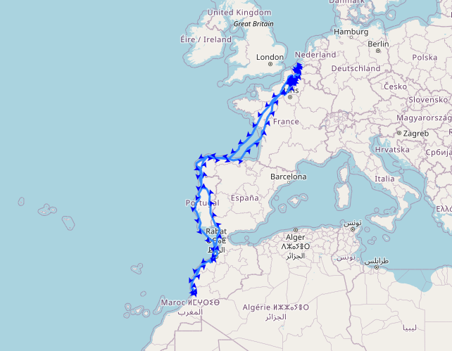

# Bird-Movement
This repository provides tools to explore, analyze and visualize GPS tracking data of birds. 

The used dataset is the Kaggle bird-tracking dataset: https://www.kaggle.com/datasets/saikrishna20/bird-tracking . 

It includes a temporal analysis and spatial visualization via a Python class BirdTrackerVisualizer to

* Plot trajectories for single or multiple birds
* Plot start or end points or whole trajectories
* Display movement of birds with arrows on trajectories

